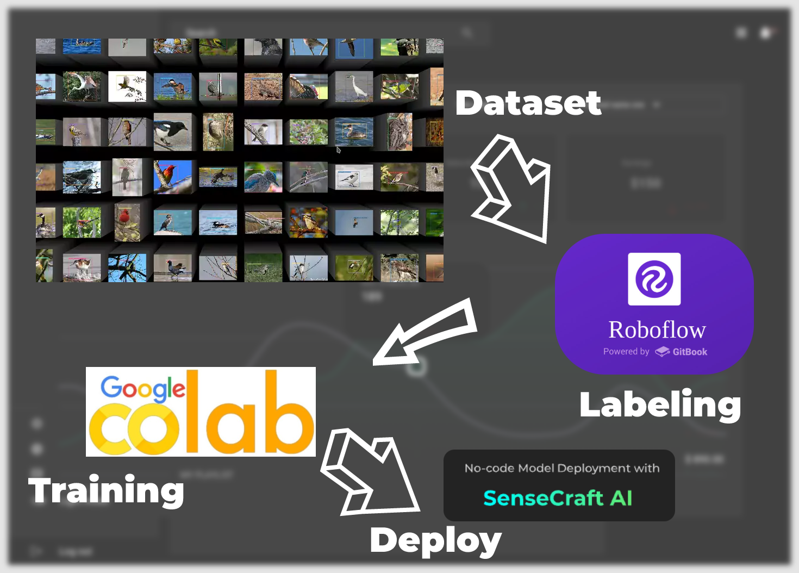

# 基于 Grove Vision AI V2 的苹果识别

本项目使用 **Grove Vision AI V2** 模块构建一个边缘计算视觉应用，识别苹果并判断其新鲜度。项目涵盖了数据集准备、模型训练、部署及与 ESP32 的联调。

---

## 目录

- [基于 Grove Vision AI V2 的苹果识别](#基于-grove-vision-ai-v2-的苹果识别)
  - [目录](#目录)
  - [项目概述](#项目概述)
  - [硬件需求](#硬件需求)
  - [硬件连接图](#硬件连接图)
  - [主要步骤](#主要步骤)
  - [成果展示](#成果展示)
  - [连接XIAO ESP32C3](#连接xiao-esp32c3)
  - [XIAO ESP32C3 代码](#xiao-esp32c3-代码)
  - [注意](#注意)
  - [参考资料](#参考资料)

---

## 项目概述

本项目利用 Grove Vision AI V2 模块训练和部署了一个 **TFLite INT8** 模型，结合 ESP32 实现了苹果识别及结果的物联网应用。

---

## 硬件需求

1. Grove Vision AI V2 模块  
2. XIAO ESP32C3 微控制器  
3. LED （用于显示识别结果）  
4. Grove 连接线及必要配件  

## 硬件连接图

---

## 主要步骤

1. **标注数据集**  
   - 使用 [Roboflow 平台](https://universe.roboflow.com/ds-lxa2d/apples-daz2v) 或自行标注图片数据集。  

2. **训练模型**  
   - 在 [Google Colab](https://wiki.seeedstudio.com/grove_vision_ai_v2_sscma/#training-dataset-exported-model) 上训练自定义 YOLO 模型。

3. **模型部署**  
   - 使用 [SenseCraft Model Assistant](https://wiki.seeedstudio.com/grove_vision_ai_v2_sscma/#upload-models-via-sensecraft-model-assistant) 将模型上传到 Grove Vision AI V2。

4. **开发应用程序**  
   - 利用 Vision AI 模块的推理结果，结合 ESP32 开发物联网应用。

---

## 成果展示

通过训练，系统实现了对苹果的准确识别，并判断其新鲜度。以下是部分成果展示：

- **数据集**：[Roboflow 苹果数据集](https://universe.roboflow.com/ds-lxa2d/apples-daz2v)  
- **模型格式**：INT8 Vela TFLite

---

## 连接XIAO ESP32C3 

Grove Vision AI V2 模块在本地完成图像处理和推理，结果通过 I2C 协议传输至 **XIAO ESP32C3**。ESP32C3 作为系统的主控单元，同时提供 Wi-Fi 和蓝牙功能，用于调试和数据转发。

了解更多关于 XIAO ESP32C3 的信息：[快速入门](https://wiki.seeedstudio.com/XIAO_ESP32C3_Getting_Started)。

---

## XIAO ESP32C3 代码

`ESP32C3-Project`中代码用于 ESP32C3 接收 Grove Vision AI V2 的推理结果，并通过 LED 指示识别状态。

## 注意

- [Grove Vision AI V2 Wiki](https://wiki.seeedstudio.com/) 官方教程中文站中有的内容相对于英文站有所缺失，应该尽量阅读访问英文站。

## 参考资料

- [Grove Vision AI V2 快速入门](https://wiki.seeedstudio.com/cn/grove_vision_ai_v2_software_support/)
- [使用 Model Assistant 训练 YOLO](https://wiki.seeedstudio.com/ModelAssistant_Tutorials_Training_YOLO/)
- [SenseCraft AI 平台](https://sensecraft.seeed.cc/ai/#/home)
- [部署模型到 Grove Vision AI V2](https://wiki.seeedstudio.com/grove_vision_ai_v2_sscma/#training-dataset-exported-model)
- [创客案例分享](https://zhuanlan.zhihu.com/p/688475017)
